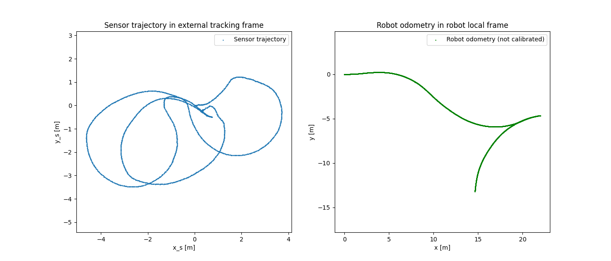
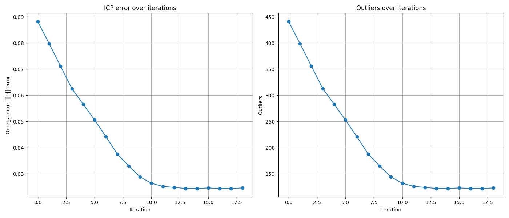
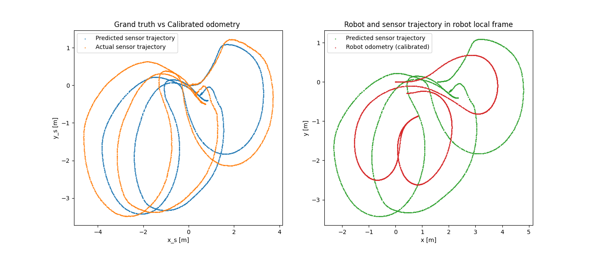

# Probabilistic_Robotics_project-4-Calibration_of_a_-real-_Robot
This repository contains the project developed for the *Probabilistic Robotics* course.  
The work focuses on the calibration of the kinematic parameters and the sensor position of a front–rear tricycle-like real robot.

## Collected Data
The dataset collected during the robot’s motion contains the following information:
- **time**: the timestamp of each measurement  
- **ticks**: encoder readings  
  - the first value corresponds to the steering encoder (absolute)  
  - the second value corresponds to the traction encoder (incremental)  
- **tracker_pose**: the position of the sensor provided by an odometry system associated with the sensor  

In the following are reported the reconstructed trajectories of the sensor and the trajectory of the kinematic center of the robot obtained trhough **not-calibrated** odometry:


## Kinematic model

the kinematic model adopted is:

$$
\begin{equation}
\begin{cases}
\phi_k = u_{\phi,k} T_s \\
\Delta \theta_k = u_{\delta,k} T_s \dfrac{\sin(\phi_k)}{b} \\
\Delta x_k = u_{\delta,k} T_s \cos(\phi_k)\cos(\Delta \theta_k) \\
\Delta y_k = u_{\delta,k} T_s \cos(\phi_k)\sin(\Delta \theta_k)
\end{cases}
\end{equation}
$$

## Algorithm
gg

## Results
The evolution of the Omega norm of the error and the number of outliers during the execution of the algorithm is shown below:


At the beginning, the error norm remains relatively contained, with some initial increases caused by measurement noise and by the ill-conditioning of the Jacobian (due to the numerical approximation used). After these first iterations, the error progressively converges to a smaller value.  
In parallel, the number of outliers (measurements inconsistent with the model and producing a significantly high error) decreases as iterations proceed.  
This behavior demonstrates that the **Least Squares on Manifold** algorithm revealed effective for this calibration task.


After calibration, the predicted sensor trajectory aligns closely with the measured one, clear evidence of successful calibration.  

However, due to numerical approximation and measurement noise, the predicted trajectory is not perfectly superimposed on the ground truth, but the residual shift remains minimal.

## How to run the code
1. Clone the repo
2. Create the build folder inside the repo of the project and do cmake
   ```bash
   cd Probabilistic_Robotics_project-4-Calibration_of_a_-real-_Robot/
   mkdir build
   cd build
   cmake ..
   ```
   The correct structure of the repository is:
   ```bash
      Probabilistic_Robotics_project-4-Calibration_of_a_-real-_Robot/
      ├── 04-Calibration
      │   ├── dataset.txt
      │   ├── README.txt
      │   └── view_traj.py
      ├── build/              # Compiled files
      │   ├── calibration
      │   ├── calibrated_params.csv
      │   └── error_log.csv
      ├── include/            # Header files
      │   ├── parse_dataset.h
      │   ├── tricycle_model.h
      │   └── utils.h
      ├── src/                # Source code
      │   ├── calibration.cpp
      │   ├── parse_dataset.cpp
      │   ├── tricycle_model.cpp
      │   └── utils.cpp
      ├── scripts_py/         # Python scripts
      │   ├── requirements.txt
      │   ├── check_correction.py
      │   └── plot_error.py
      ├── CMakeLists.txt      
      └── README.md        
   ```
3. Make sure that any `dataset.txt` to be used has the same form of the one provided:
   ```bash
   #kinematic_model: ...
   #parameters: ...
   #parameter_values: ... 
   #joints_max_enc: ...
   #joints_max_enc_values: ... 
   #laser wrt base_link 
   #	translation:	...,
   #	rotation:	 ...
   time: ... ticks: ... model_pose: ... tracker_pose: ...
   ...
   ```
4. Compile and run the calibration executable with arg the `<path_to_the_dataset>`:
   ```bash
    make
    ./calibration ../04-Calibration/dataset.txt
   ```
5. This will generate in the `build` folder the files `calibrated_params.csv` and `error_log.csv`.  
   Plots can be visualized through:
   ```bash
   python ../scripts_py/check_correction.py
   python ../scripts_py/plot_error.py
   ```
