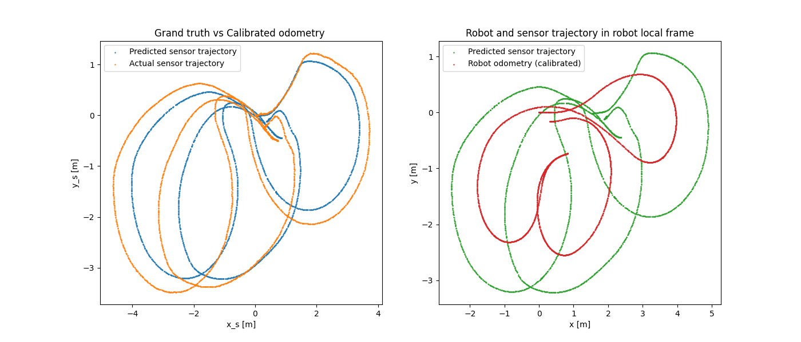

# Probabilistic_Robotics_project-4-Calibration_of_a_-real-_Robot
This repository contains the project developed for the *Probabilistic Robotics* course.  
The work focuses on the calibration of the kinematic parameters and the sensor position of a front–rear tricycle-like real robot.

## Collected Data
The dataset collected during the robot’s motion contains the following information:
- **time**: the timestamp of each measurement  
- **ticks**: encoder readings  
  - the first value corresponds to the steering encoder (absolute)  
  - the second value corresponds to the traction encoder (incremental)  
- **tracker_pose**: the position of the sensor provided by an odometry system associated with the sensor  

In the following are reported the reconstructed trajectories of the sensor and the trajectory of the kinematic center of the robot obtained trhough **not-calibrated** odometry:


The parameters to be calibrated are:
- $x_s$: x-coordinate of the sensor position in the robot reference frame
- $y_s$: y-coordinate of the sensor position in the robot reference frame
- $\theta_s$: orientation (angle) of the sensor in the robot reference frame
- $K_{steer}$: conversion factor indicating how many radians correspond to one tick of the steering encoder
- $K_{traction}$: conversion factor indicating how many meters correspond to one tick of the traction encoder
- $\gamma_{off}$: steering angle corresponding to the mechanical zero of the wheel
- $b$: distance between the center of the rear axle and the front wheel (baseline)


## Kinematic model
The configuration space of the robot is $SE(2) \times SO(2)$.  
With reference to the conventions defined in the figure below, which illustrate the displacements of the FWD tricycle during a step:

<div align="center">
  
</div>


where the discrete inputs are:

$$
\begin{equation}
\begin{cases}
\phi_k = \alpha_{k} \\
\Delta \theta_k = u_{\delta,k} T_s \cdot \dfrac{\sin(\phi_k)}{b} \\
\Delta x_k = u_{\delta,k} T_s \cdot \cos(\phi_k)\cos(\Delta \theta_k) \\
\Delta y_k = u_{\delta,k} T_s \cdot \cos(\phi_k)\sin(\Delta \theta_k)
\end{cases}
\end{equation}
$$

where the steer angle and the discrete input are:

$$
\alpha_{k} = K_{steer} \cdot t^s_{k}  \cdot \frac{2 \pi}{T^s_{max}} + \gamma_{off}
$$
$$
u_{\delta,k} = \frac{K_{traction}  \cdot \frac{\delta t^t_{k}}{T^t_{max}}}{T_s}
$$

Here:
- $T^t_{max}$ and $T^s_{max}$ are the maximum values for the traction and steering encoder ticks.  
- $t^s_{k}$ is the absolute encoder reading from the steering axis.  
- $\delta t^t_{k}$ is the difference between two consecutive readings of the incremental encoder mounted on the steering wheel, processed to avoid overflow errors.

## Algorithm

### State space
The state of the Least Square problem is:

$$
X =
\begin{bmatrix}
{}^{r}T_{s} \\
K_{steer} \\
K_{traction} \\
b \\
\gamma_{off}
\end{bmatrix}
\in \mathbb{R}^4 \times SE(2)$$

The Euclidean parametrization for the chart is:

$$
\Delta_{X}  =
\begin{bmatrix}
\Delta {}^{r}x_{s} \\
\Delta {}^{r}y_{s} \\
\Delta {}^{r}\theta_{s} \\
\Delta K_{steer} \\
\Delta K_{traction} \\
\Delta b \\
\Delta \gamma_{off}
\end{bmatrix}
\in \mathbb{R}^7 $$

In order to handle operations envolving a point in the manifold and an the Euclidean parametrization for the chart around that point we need to define the boxplus operator in the following way:

$$
X\boxplus \Delta_{X} = \begin{bmatrix}
v2t
\begin{pmatrix}
{}^{r} \Delta x_{s} \\
{}^{r} \Delta y_{s} \\
{}^{r} \Delta \theta_{s} 
\end{pmatrix} \cdot {}^{r}T_{s} \\
K_{steer} + \Delta K_{steer} \\
K_{traction} + \Delta K_{traction} \\
b + \Delta b \\
\gamma_{off} + \Delta \gamma_{off}
\end{bmatrix}
$$

### Measurement space
The measurement $Z^{(i)}$ is defined as the relative pose displacement of the sensor when the robot moves from pose $i-1$ to pose $i$ expressed in the reference frame of sensor $i-1$. Formally:

$$
Z = \Delta z \in SE(2)
$$

where $\Delta z$ is given by:

$$
^{i-1}\Delta z_{i} = {}^{ex}T_{s, i-1}^{-1} \cdot {}^{ex}T_{s, i}
$$

Here, ${}^{ex}T_{s, j}$ denotes the homogeneous transformation matrix of the sensor pose at time step $j$, expressed with respect to the external tracking system.

The Euclidean parametrization for the measurment is:

$$
\zeta = \begin{bmatrix}
{}^{s,i-1} \Delta x_{s,i} \\
{}^{s,i-1} \Delta y_{s,i} \\
{}^{s,i-1} \Delta \theta_{s,i} 
\end{bmatrix} \in \mathbb{R}^3
$$

To handle operations involving these measurements, it is necessary to introduce the box-minus operator:

$$
h(X, \Delta_r) \boxminus Z = Z^{-1} \cdot h(X, \Delta r)
$$

### Prediction function
The prediction function models the relative pose displacement of the sensor when the robot moves from step $i-1$ to step $i$ by an amount $\Delta r$ expressed in the reference frame of sensor $i$:

$$
h(X, \Delta r) = {}^{r}T_{s}^{-1} \cdot \Delta r \cdot {}^{r}T_{s}
$$


### Error function
The error function quantifies the difference between the predicted sensor displacement and the measured displacement:

$$
e(X) = h(X, \Delta r) \boxminus Z 
$$

### Least Squares on manifold
The algorithm adopted can be summarized as follows:

$$
\begin{aligned}
&\textbf{for } i = 1, \ldots, \texttt{max iterations}:\\
&\quad H \leftarrow 0,\quad b \leftarrow 0,\quad \chi \leftarrow 0\\
&\quad \textbf{for each } j = 1, \ldots, N:\\
&\quad\quad Z, \delta t_j^{t}, t_j^{s} \leftarrow \texttt{get sensor reading}(j)\\
&\quad\quad \Delta_r \leftarrow \texttt{model prediction}(X, \delta t_j^{t}, t_j^{s})\\
&\quad\quad e_j \leftarrow h(X, \Delta r)\boxminus Z\\
&\quad\quad J_j \leftarrow \texttt{compute jacobian}(X, \Delta r, Z)\\
&\quad\quad H \leftarrow H + J_j^{\top}\Omega J_j\\
&\quad\quad b \leftarrow b + J_j^{\top}\Omega e_j\\
&\quad\quad \chi \leftarrow \chi + e_j^{\top}\Omega e_j\\
&\quad \textbf{end for}\\
&\quad \Delta X \leftarrow \texttt{solve}(H \cdot \Delta X = -b)\\
&\quad X \leftarrow X \boxplus \Delta_X\\
&\textbf{end for}
\end{aligned}
$$

Here, $e_j$ denotes the error corresponding to the $j$-th sample, while $J_i$ represents the Jacobian matrix, computed numerically.

## Results
The evolution of the Omega norm of the error and the number of outliers during the execution of the algorithm is shown below:


At the beginning, the error norm remains relatively contained, with some initial increases caused by measurement noise and by the ill-conditioning of the Jacobian (due to the numerical approximation used). After these first iterations, the error progressively converges to a smaller value.  
In parallel, the number of outliers (measurements inconsistent with the model and producing a significantly high error) decreases as iterations proceed.  
This behavior demonstrates that the **Least Squares on Manifold** algorithm revealed effective for this calibration task.


After calibration, the predicted sensor trajectory aligns closely with the measured one, clear evidence of successful calibration.  

However, due to numerical approximation and measurement noise, the predicted trajectory is not perfectly superimposed on the ground truth, but the residual shift remains minimal. The experimental results have been obtained using max iterations = 13.

## How to run the code
1. Clone the repo
2. Create the build folder inside the repo of the project and do cmake
   ```bash
   cd Probabilistic_Robotics_project-4-Calibration_of_a_-real-_Robot/
   mkdir build
   cd build
   cmake ..
   ```
   The correct structure of the repository is:
   ```bash
      Probabilistic_Robotics_project-4-Calibration_of_a_-real-_Robot/
      ├── 04-Calibration
      │   ├── dataset.txt
      │   ├── README.txt
      │   └── view_traj.py
      ├── build/              # Compiled files
      │   ├── calibration
      │   ├── calibrated_params.csv
      │   └── error_log.csv
      ├── include/            # Header files
      │   ├── parse_dataset.h
      │   ├── tricycle_model.h
      │   └── utils.h
      ├── src/                # Source code
      │   ├── calibration.cpp
      │   ├── parse_dataset.cpp
      │   ├── tricycle_model.cpp
      │   └── utils.cpp
      ├── scripts_py/         # Python scripts
      │   ├── requirements.txt
      │   ├── check_correction.py
      │   └── plot_error.py
      ├── CMakeLists.txt      
      └── README.md        
   ```
3. Make sure that any `dataset.txt` to be used has the same form of the one provided:
   ```bash
   #kinematic_model: ...
   #parameters: ...
   #parameter_values: ... 
   #joints_max_enc: ...
   #joints_max_enc_values: ... 
   #laser wrt base_link 
   #	translation:	...,
   #	rotation:	 ...
   time: ... ticks: ... model_pose: ... tracker_pose: ...
   ...
   ```
4. Compile and run the calibration executable with arg the `<path_to_the_dataset>`:
   ```bash
    make
    ./calibration ../04-Calibration/dataset.txt
   ```
5. This will generate in the `build` folder the files `calibrated_params.csv` and `error_log.csv`.  
   Plots can be visualized through:
   ```bash
   python ../scripts_py/check_correction.py
   python ../scripts_py/plot_error.py
   ```
